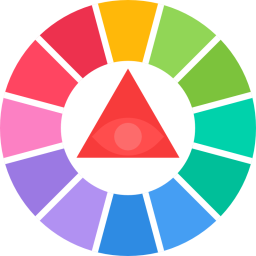
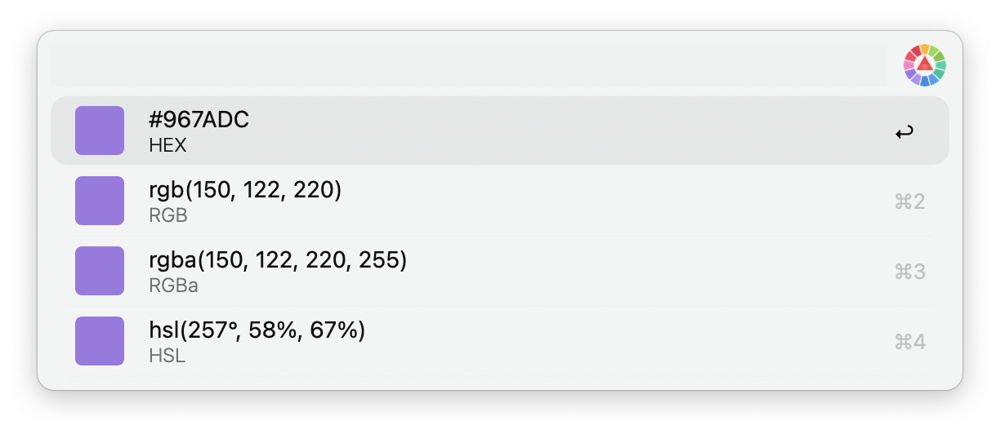
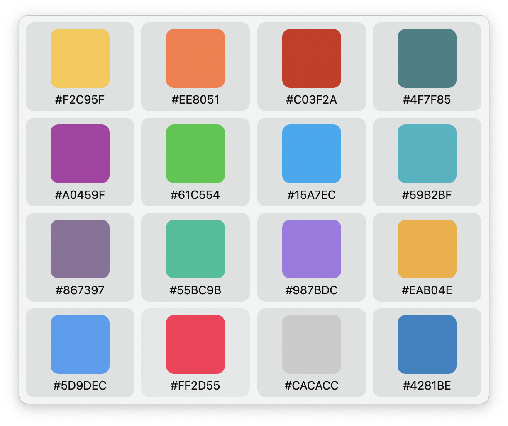

# Color Picker

[Visit on Github](https://github.com/albertcai101/alfred-color-picker-workflow)

---

## Usage 

Activate the *Color Sampler* with the keyword (default: `cp`) and pick the desired color.

## Color History

To review previously picked colors, activate the workflow with the keyword preceded by a colon (default: `:cp`).

## Important Note
This is build on the [Color Picker Workflow](https://alfred.app/workflows/zeitlings/color-picker/) by Patrick Sy. The only difference is the fix in Hex Code Color, where the full hex code is diplayed rather than a potential shorthand.
